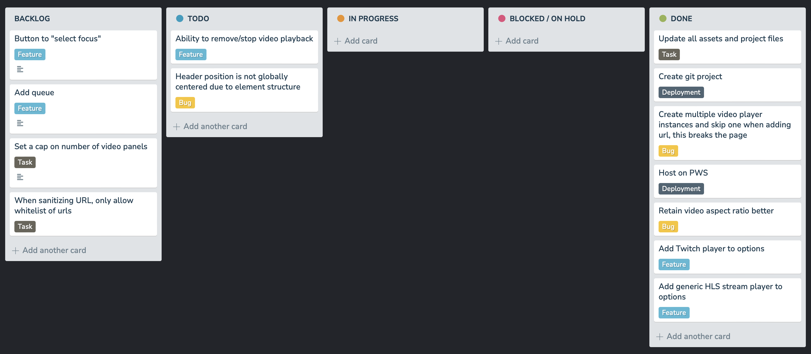

# redzone
An "NFL Redzone"-like experience for web video players.

## Finding a Stream
You can paste in a YouTube or Twitch link to a video player and the stream will be embedded int this page.

You can also find a explicit stream link (see `Stream Formats` below) and the stream will be embedded in this page.

## Stream Formats
This project can stream the following types of content:
- HLS
    - API Based via YouTube and Twitch API embedded HLS streams.
    - Standard HLS streaming when provided with a `.m3u8` stream link or equivalent.

## Are you overstimulated yet?

## Project Tracking

*Kanban Board (Updated 10/01/25)*

## Example Explicit Streams

| Title | Link | Type |
|---|---|---|
| Hawaii News Now (requires auth token) | https://dai2-playlistserver.aws.syncbak.com/cpl/18660110/dai2v5/1/7b2264657669636554797065223a382c22616b616d61694d7670644b6579223a6e756c6c7d/master.m3u8?access_token=eyJhbGciOiJIUzI1NiIsInR5cCI6IkpXVCIsImtpZCI6IjIwMTYwNDAxIn0.eyJkZXZpY2VUeXBlIjo4LCJzaWQiOjczMywiY2lkIjoxNzE0OCwibWlkIjoxODY2MDExMCwibWsiOm51bGwsIm9vbSI6dHJ1ZSwiaXAiOiIxODUuODEuMTI0LjEyIiwidWlwIjoiMTg1LjgxLjEyNC4xMiIsImRtYSI6ODA3LCJzc2lkIjoiYjg0NjYxYjViYmJhNDllOWI3N2UxNzVlNDVjOWM1YjQiLCJzbiI6IldlYiBkZGZhZTc5M2NmICggbnVsbCApIiwidWlkIjpudWxsLCJhcHN0IjpudWxsLCJzYmVwIjpmYWxzZSwiY3NiIjpmYWxzZSwibWQ1IjoiZjJkOWM4ZDViODhlZGJkZDI1ZjFmZDU4MjQ0NmU3YTMiLCJpYXQiOjE3NTcyNzU0NzgsImV4cCI6MTc1NzI3NTc3OCwiYXVkIjoiaHR0cHM6Ly9wbGF5bGlzdHNlcnZlci5hd3Muc3luY2Jhay5jb20iLCJpc3MiOiJTeW5jYmFrIEdyYXBoUUwgQVBJIiwic3ViIjoiX1h2bHl6TURwSEhVbV9CM19La29MVkczbE95QXR0R1NiQUJLU3B4SDBwMmxUOUVKU08ifQ.-vB7T1R5drAhONi-nROZV7UoemDKYQhev40j9zqyGKY | HLS m3u8 stream hosted on AWS |
| KWCH Channel 12 News (requires auth token) | https://dai2-playlistserver.aws.syncbak.com/cpl/13729464/dai2v5/1/7b2264657669636554797065223a382c22616b616d61694d7670644b6579223a6e756c6c7d/master.m3u8?access_token=eyJhbGciOiJIUzI1NiIsInR5cCI6IkpXVCIsImtpZCI6IjIwMTYwNDAxIn0.eyJkZXZpY2VUeXBlIjo4LCJzaWQiOjIyOCwiY2lkIjoxMjEyMywibWlkIjoxMzcyOTQ2NCwibWsiOm51bGwsIm9vbSI6dHJ1ZSwiaXAiOiIxODUuODEuMTI0LjEyIiwidWlwIjoiMTg1LjgxLjEyNC4xMiIsImRtYSI6ODA3LCJzc2lkIjoiYzIyM2FlM2M4NGU1NDgwMjhmNGEyMjUxYTU4YWM0NGYiLCJzbiI6IldlYiA4YmNkZDVmZjI0ICggbnVsbCApIiwidWlkIjpudWxsLCJhcHN0IjpudWxsLCJzYmVwIjpmYWxzZSwiY3NiIjpmYWxzZSwibWQ1IjoiMzcxNzRjN2Y5NmIxZWVlZmY1YmYxY2UwZjk0MTc2NTYiLCJpYXQiOjE3NTcyNzUxMjEsImV4cCI6MTc1NzI3NTQyMSwiYXVkIjoiaHR0cHM6Ly9wbGF5bGlzdHNlcnZlci5hd3Muc3luY2Jhay5jb20iLCJpc3MiOiJTeW5jYmFrIEdyYXBoUUwgQVBJIiwic3ViIjoiZzJ1SWdKTkp6ODNEX18xc2M2MEJSNGVwRm04VGlkaDNZMFU1NUdWU1Axemtab0V3MlAifQ.foCZTCEc76SHhOAsSTsaYHUvpb3RWxd0SrcSYdre4F0 | HLS m3u8 stream hosted on AWS |
| Nashville Channel 5 News | https://content.uplynk.com/channel/0d3d579b1d0948878a17dcb7eca85021.m3u8 | HLS .m3u8 stream hosted on `Uplynk.com` |

## Build
`docker compose down && docker compose up --build -d && docker logs -f redzone`
